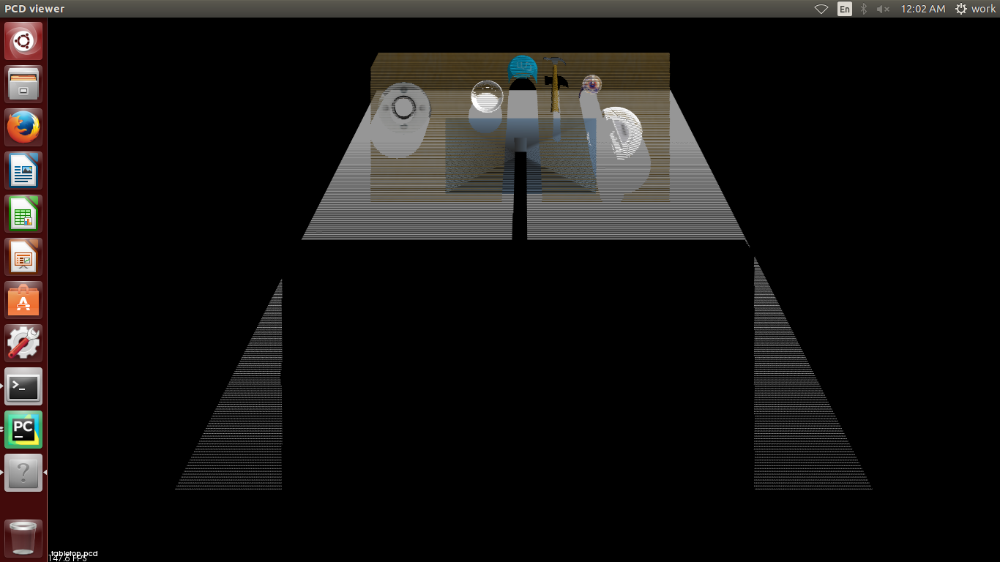
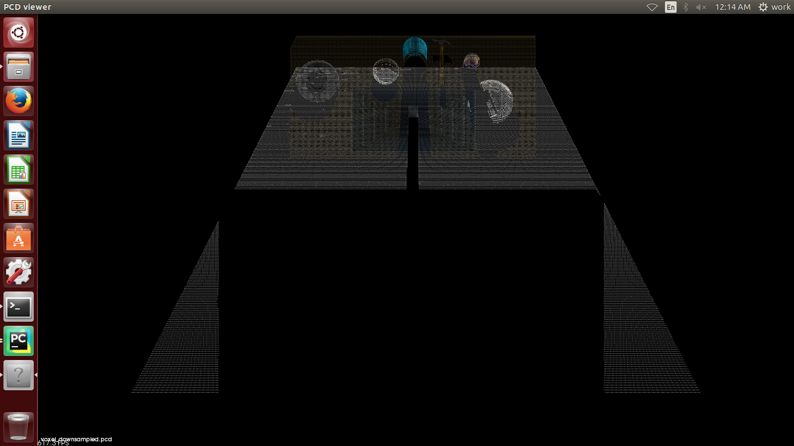
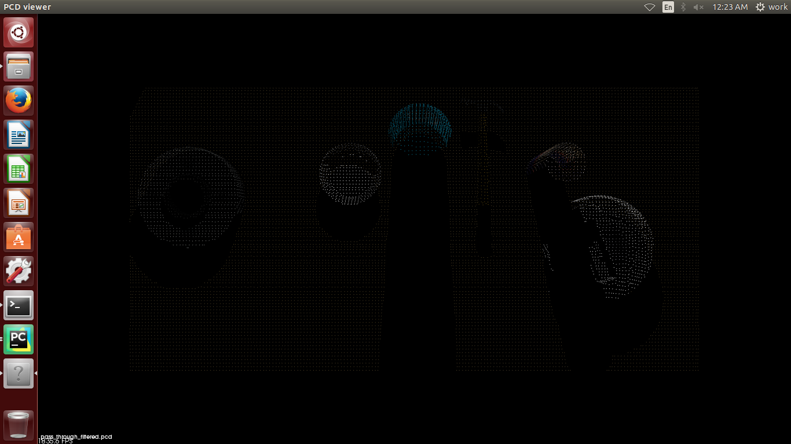
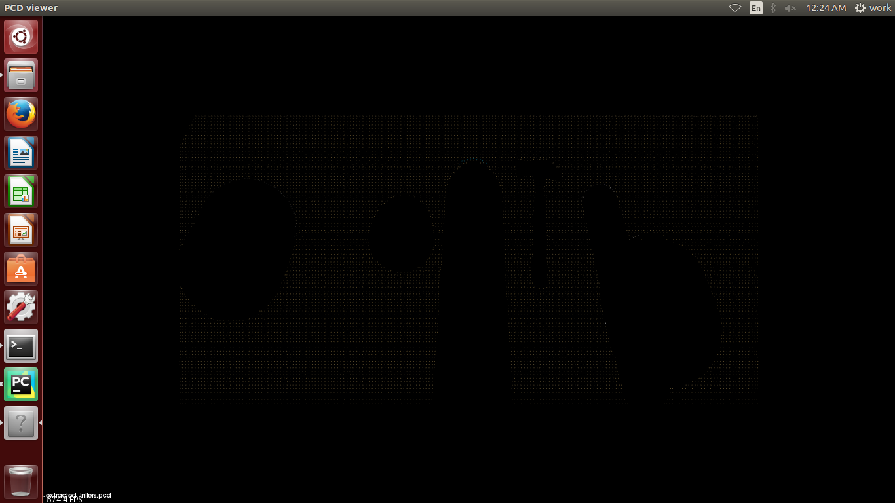
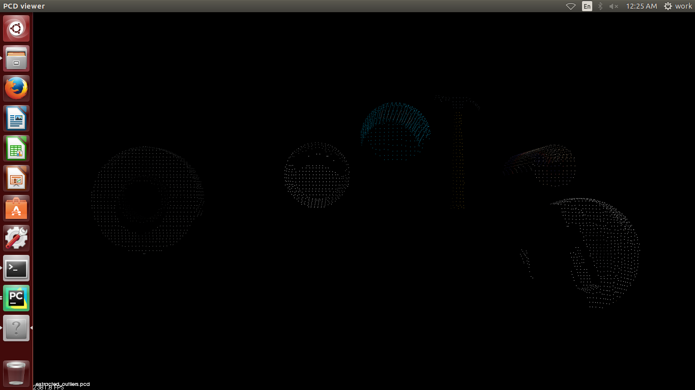
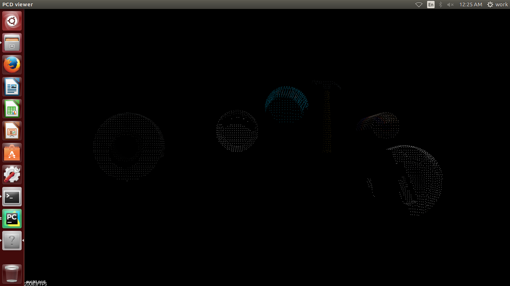
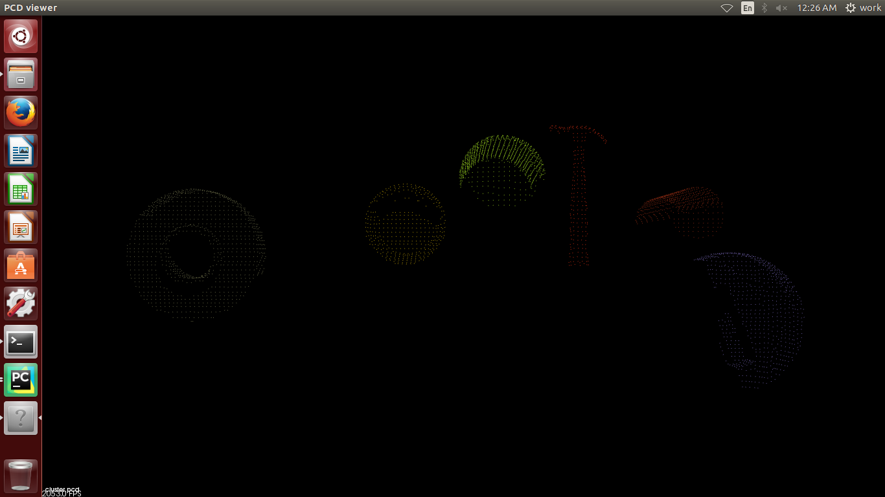

## Project: Perception Pick & Place
### Writeup Template: You can use this file as a template for your writeup if you want to submit it as a markdown file, but feel free to use some other method and submit a pdf if you prefer.

---


# Required Steps for a Passing Submission:
1. Extract features and train an SVM model on new objects (see `pick_list_*.yaml` in `/pr2_robot/config/` for the list of models you'll be trying to identify). 
2. Write a ROS node and subscribe to `/pr2/world/points` topic. This topic contains noisy point cloud data that you must work with.
3. Use filtering and RANSAC plane fitting to isolate the objects of interest from the rest of the scene.
4. Apply Euclidean clustering to create separate clusters for individual items.
5. Perform object recognition on these objects and assign them labels (markers in RViz).
6. Calculate the centroid (average in x, y and z) of the set of points belonging to that each object.
7. Create ROS messages containing the details of each object (name, pick_pose, etc.) and write these messages out to `.yaml` files, one for each of the 3 scenarios (`test1-3.world` in `/pr2_robot/worlds/`).  [See the example `output.yaml` for details on what the output should look like.](https://github.com/udacity/RoboND-Perception-Project/blob/master/pr2_robot/config/output.yaml)  
8. Submit a link to your GitHub repo for the project or the Python code for your perception pipeline and your output `.yaml` files (3 `.yaml` files, one for each test world).  You must have correctly identified 100% of objects from `pick_list_1.yaml` for `test1.world`, 80% of items from `pick_list_2.yaml` for `test2.world` and 75% of items from `pick_list_3.yaml` in `test3.world`.
9. Congratulations!  Your Done!

# Extra Challenges: Complete the Pick & Place
7. To create a collision map, publish a point cloud to the `/pr2/3d_map/points` topic and make sure you change the `point_cloud_topic` to `/pr2/3d_map/points` in `sensors.yaml` in the `/pr2_robot/config/` directory. This topic is read by Moveit!, which uses this point cloud input to generate a collision map, allowing the robot to plan its trajectory.  Keep in mind that later when you go to pick up an object, you must first remove it from this point cloud so it is removed from the collision map!
8. Rotate the robot to generate collision map of table sides. This can be accomplished by publishing joint angle value(in radians) to `/pr2/world_joint_controller/command`
9. Rotate the robot back to its original state.
10. Create a ROS Client for the “pick_place_routine” rosservice.  In the required steps above, you already created the messages you need to use this service. Checkout the [PickPlace.srv](https://github.com/udacity/RoboND-Perception-Project/tree/master/pr2_robot/srv) file to find out what arguments you must pass to this service.
11. If everything was done correctly, when you pass the appropriate messages to the `pick_place_routine` service, the selected arm will perform pick and place operation and display trajectory in the RViz window
12. Place all the objects from your pick list in their respective dropoff box and you have completed the challenge!
13. Looking for a bigger challenge?  Load up the `challenge.world` scenario and see if you can get your perception pipeline working there!

## [Rubric](https://review.udacity.com/#!/rubrics/1067/view) Points
### Here I will consider the rubric points individually and describe how I addressed each point in my implementation.  

---
### Writeup / README

#### 1. Provide a Writeup / README that includes all the rubric points and how you addressed each one.  You can submit your writeup as markdown or pdf.
  

You're reading it!

### Exercise 1, 2 and 3 pipeline implemented
#### 1. Complete Exercise 1 and 2 steps. Pipeline for filtering, RANSAC plane fitting, segmentation, and clustering implemented.

Voxel downsampling, passthrough filtering, RANSAC plane segmentation, and Euclidean clustering were all performed on a 
sample pcl cloud data, in the aforementioned order.  The code can be found in 
```RoboND-Perception-Exercises/Exercise-1/RANSAC.py``` and the results are shown below. 

##### Original data



##### After voxel downsampling
This is done to reduce the total number of points on the scene to save on compute time and processing cycles.




##### After passthrough filtering
This is done with the intention of removing extraneous points that are unnecessary to our purposes.  In this instance, 
we are only interested in the table top and the obects found on top of it. 




##### After RANSAC plane segmentation
This is done to separate the table surface from the objects on the table surface.  We segment it by identifying the 
plane in the scene, and all the points that comprise it.  We also obtain all the points that do _not_ comprise this 
plane, which are basically our objects.

###### RANSAC plane inliers (table surface)



###### RANSAC plane outliers (non table-surface points)



##### After Euclidean clustering
This is done to group or cluster each point with a particular group.  The idea is that each point belongs to the cluster
that is closest to it, and that each cluster comprise an object of interest on top of the table.




##### Color coding clusters
We color code each point to show which cluster it belongs to




#### 2. Complete Exercise 3 Steps.  Features extracted and SVM trained.  Object recognition implemented.
For exercise 3, we: 
1. Generate training sets by capturing color and normal historgrams of objects.  The script used in this instance can be
found at `RoboND-Perception-Exercises/Exercise-3/sensor_stick/scripts/capture_features.py`. In this instance, we 
iterated 100 times for each object. The resultant training set can be found at 
`RoboND-Perception-Exercises/Exercise-3/sensor_stick/scripts/training_sets/training_set_complete_100_with_dropbox.sav`. 
2. Once training sets have been generated, we proceed to train our models using these.  The training script used can be 
found at `RoboND-Perception-Exercises/Exercise-3/sensor_stick/scripts/train_svm.py` and the resulting model can be found 
at `RoboND-Perception-Exercises/Exercise-3/sensor_stick/scripts/models/model_100_with_dropbox.sav`. The resultant 
confusion matrices are shown below


### Pick and Place Setup

#### 1. For all three tabletop setups (`test*.world`), perform object recognition, then read in respective pick list (`pick_list_*.yaml`). Next construct the messages that would comprise a valid `PickPlace` request output them to `.yaml` format.

And here's another image! 


Spend some time at the end to discuss your code, what techniques you used, what worked and why, where the implementation might fail and how you might improve it if you were going to pursue this project further.  

